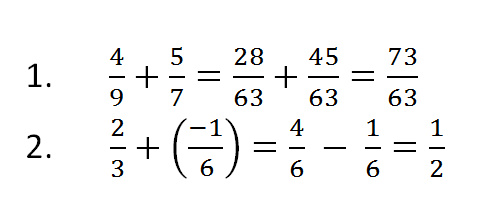

# [Testing](https://www.e-olymp.com/en/contests/8903/problems/76961)

This year Andrew must pass testing at school including math course. He aggressively prepare himself - he already solves complex trigonometric equations easily do stereometry, but with rational numbers (fractions) things are bad, especially with their addition. He even afraids to make a mistake in writing the testing program. Do it for him. Recall that a rational number is defined as an irreducible fraction, where the numerator is an integer, and the denominator is a natural number.

## Input

Four integer - the numerator and denominator of the first fraction and the numerator and denominator of the second fraction. All numbers are not greater 105 by absolute value.

## Output

Print the numerator and denominator of the fraction's sum.



_Time limit 1 second_

_Memory limit 122.17 MiB_


## Input example #1
```
4 9 5 7
```

## Output example #1
```
73 63
```

## Input example #2
```
2 3 -1 6
```

## Output example #2
```
1 2
```