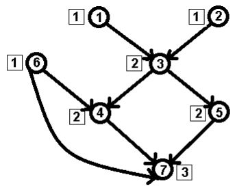

# [Strahler Order](https://www.e-olymp.com/en/contests/9116/problems/79195)

In geology, a river system can be represent as a direct graph. Each river segment is an edge; with the edge pointing the same way the waters flows. Nodes are either the source of a river segment (for example, a lake or spring), where rivers segments merge of diverge, or the mouth of the river.

The Strahler order of a river system is computed as follows.

The order of each source node is 1.
For every other node, let i be the highest order of all its upstream nodes. If just one upstream node has order i, then this node also has order i. If two or more upstream nodes have order i, then this node has order i + 1.
The order of the entire river system is the order of the mouth node. In this problem, the river system will have just one mouth. In the picture above, The Strahler order is three (3).



The number in a box is the order. The number in a circle is the node number.

You must write a program to determine the order of a given river system.

The actual river with the highest order is the Amazon, with order 12. The highest in the U.S. is the Mississippi, width order 10.

## Input

The first line contains the number k (1 ≤ k ≤ 1000) of data sets that follow. Each data set should be processed independently.

Each data set consists of multiple lines. The first line of each data set contains three positive integers k, m and p (2 ≤ m ≤ 1000). k is the data set number. m is the number of nodes in the graph and p is the number of edges. The first line is followed by p lines, each describing an edge of the graph. The line will contain two positive integers a and b, indicating that water flows from node a to node b (1 ≤ a, b ≤ m). Node m is the mouth of the river. It has no outgoing edges.

## Output

For each data set there is a single line of output. The line consists o the data set number, a single space and the order of the river system.

_Time limit 1 second_

_Memory limit 122.17 MiB_

## Input example #1
```
1
1 7 8
1 3
2 3
6 4
3 4
3 5
6 7
5 7
4 7
```

## Output example #1
```
1 3
```
